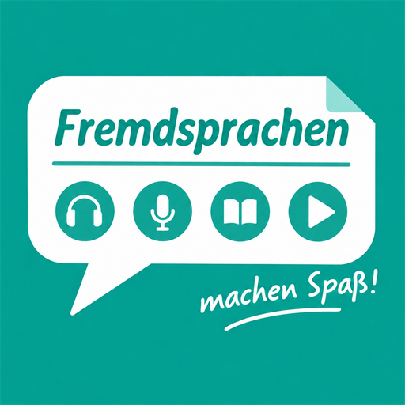

  
  <h1>FmS — fms-app</h1>
  
<strong>Fremdsprachen machen Spaß!</strong> — Foreign languages are fun.

  

    A local-first language learning desktop app built around <em>listening, speaking, reading and vocabulary</em>,
    powered by on-device AI.
  

  

    
    
    
    
    
  

---

## What is this?

FmS turns authentic audio — textbook recordings, audiobooks, podcasts — into structured
**dictation and speaking practice**. You import a dataset, the app transcribes it with a local
speech-to-text model, generates waveforms and cue-level subtitles, and then you practice by
typing (or speaking) what you hear. Everything runs on your machine: your material, your
progress, and your models never leave the device.

The app is a **Tauri v2** port of the web version at [wsva/fms](https://github.com/wsva/fms),
and ships for **Windows and Linux** (plus an experimental **Android** client that syncs with a PC).

## Features

**Learning**
- **Dictation** — media player with canvas waveform, cue cards, and per-cue progress; compare your
  transcription against reference subtitles, in large/focus modes.
- **Speaking practice** — system-wide voice input: tap the mic (or `Ctrl+C` in any text field) and
  your speech is transcribed locally and inserted at the cursor.
- **Read a Book** — split books into chapters/sentences, read with per-sentence TTS audio (Edge TTS),
  and save words/sentences in context.
- **Read Aloud** — recite sentences aloud and get them checked against the target text.
- **Cards** — flashcard datasets with review queues, question generation, and FTS5 search.

**Tooling**
- **Dataset Studio** — staged pipeline: import → generate subtitles (STT) → waveforms → database,
  plus transcript alignment and book splitting.
- **Datasets Sync** — pull datasets from another FmS machine over the LAN or tailnet (phone ↔ PC,
  PC ↔ PC) with discovery, device pairing, and snapshot progress.
- **STT Models** — download, load, and manage local ONNX models (Parakeet family via `transcribe-rs`).
- **LLM Chat** — Ollama (local) or cloud providers through the goose SDK provider layer.
- **OCR, Edge TTS, Wiki** — capture text from images, synthesize speech, keep notes.
- **Workspaces** — multi-user data isolation with per-workspace directories and XP.

## Download

Grab a prebuilt installer from the [latest release](https://github.com/wsva/fms-app/releases/latest):

| Platform | Artifacts |
|----------|-----------|
| Windows  | `.exe` (NSIS), `.msi` |
| Linux    | `.AppImage`, `.deb`, `.rpm` |

Releases are built automatically by [GitHub Actions](.github/workflows/build.yml) on every `v*` tag.
